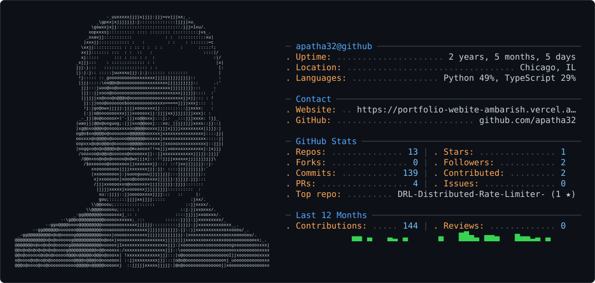

<picture>
  <source media="(prefers-color-scheme: dark)" srcset="dark_mode.svg" />
  <source media="(prefers-color-scheme: light)" srcset="light_mode.svg" />
  
</picture>
# 💫 About Me:
Here's a short README-style version, plus a one-line bio for the profile field.  **About me (profile README):**  Hi, I'm Ambarish. I'm a Forward Deployed Engineer building production AI agents for enterprise clients, from discovery through live deployment.  - At LayeredAI, I built an agent that unifies SAP, Primavera P6, and BOQ data and cut manual reconciliation from 2 days to 40 minutes. - I co-authored **devmind-cli**, an open-source PyPI tool that gives AI coding agents persistent memory using hybrid graph-vector retrieval. - I built **ClauseGuard**, a contract risk extraction agent that grounds every clause in an exact source span (82% precision, 79% recall on CUAD). - I also built **DRL**, a Redis-backed distributed rate limiter with a Q-learning agent that tunes limits under bursty traffic.  **Stack:** Python, Go, TypeScript, LangGraph, LangChain, RAG, FastAPI, React, AWS, Kubernetes, Terraform, Docker, Redis, PostgreSQL  M.S. in Computer Engineering from UIC. Based in Chicago, open to relocation.  📫 ambarishpathakms@gmail.com  **Bio field (under 160 characters):**  Forward Deployed Engineer building production AI agents. Co-author of devmind-cli. Python, Go, TypeScript, AWS, Kubernetes. Chicago.  Add your repo links to the project names if you want them clickable, and swap in your LinkedIn if you'd like it listed. I can also make this shorter or more casual.

## 🌐 Socials:
   

# 💻 Tech Stack:
                                               
# 📊 GitHub Stats:
 
 

## 🏆 GitHub Trophies

### ✍️ Random Dev Quote

### 🔝 Top Contributed Repo

---

<!-- Proudly created with GPRM ( https://gprm.itsvg.in ) -->
